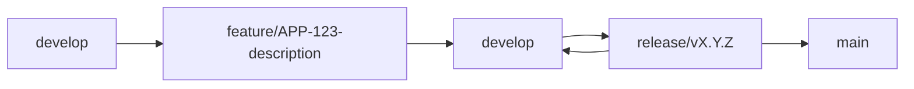
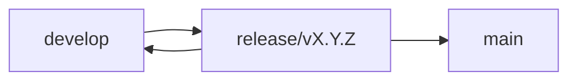
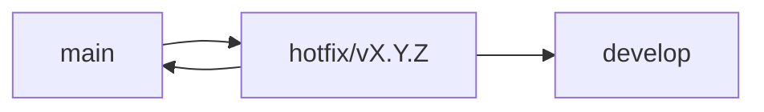

# Earkart Frontend Monorepo - Branching Strategy 🌿

## Overview

This document defines the branching strategy for the Earkart Frontend Monorepo, which includes:

- **Next.js Dashboard** - Admin dashboard application
- **Earkart Omni** - Flutter omnichannel application
- **Earkart MDM** - Flutter MDM application

## Branch Types

### 1. Main Branches

#### `main` (Production)

- **Purpose**: Production-ready code for all applications
- **Protection**:
  - Requires pull request reviews
  - Requires status checks to pass
  - No direct pushes allowed
- **Deployment**: Automatically deploys to production environments
- **Merge Policy**: Only from `develop` or hotfix branches

#### `develop` (Development)

- **Purpose**: Integration branch for all features and fixes
- **Protection**:
  - Requires pull request reviews
  - Requires status checks to pass
- **Deployment**: Automatically deploys to staging environments
- **Merge Policy**: From feature branches and release branches

### 2. Supporting Branches

#### Feature Branches

- **Naming Convention**: `feature/APP-123-description` or `feature/description`
- **Examples**:
  - `feature/dashboard-user-management`
  - `feature/omni-payment-integration`
  - `feature/mdm-product-catalog`
- **Source**: `develop`
- **Target**: `develop`
- **Lifecycle**: Created for each new feature, deleted after merge

#### Release Branches

- **Naming Convention**: `release/vX.Y.Z` or `release/vX.Y.Z-APP`
- **Examples**:
  - `release/v1.2.0`
  - `release/v2.1.0-dashboard`
  - `release/v1.0.0-omni`
- **Source**: `develop`
- **Target**: `main` and `develop`
- **Purpose**: Prepare for production release, final testing, and version bumping

#### Hotfix Branches

- **Naming Convention**: `hotfix/vX.Y.Z` or `hotfix/vX.Y.Z-APP`
- **Examples**:
  - `hotfix/v1.2.1`
  - `hotfix/v2.0.1-dashboard`
  - `hotfix/v1.1.2-omni`
- **Source**: `main`
- **Target**: `main` and `develop`
- **Purpose**: Critical production fixes that cannot wait for next release

## Workflow

### Feature Development



1. **Create Feature Branch**

   ```bash
   git checkout develop
   git pull origin develop
   git checkout -b feature/APP-123-description
   ```

2. **Development**

   - Work on your feature
   - Commit frequently with clear messages
   - Push to remote feature branch

3. **Create Pull Request**

   - Target: `develop`
   - Include description of changes
   - Request code review
   - Ensure all CI checks pass

4. **Merge to Develop**
   - After approval, merge to `develop`
   - Delete feature branch

### Release Process



1. **Create Release Branch**

   ```bash
   git checkout develop
   git pull origin develop
   git checkout -b release/v1.2.0
   ```

2. **Prepare Release**

   - Update version numbers in all apps
   - Update CHANGELOG.md
   - Final testing and bug fixes
   - Update documentation

3. **Merge to Main**

   ```bash
   git checkout main
   git merge release/v1.2.0
   git tag -a v1.2.0 -m "Release version 1.2.0"
   git push origin main --tags
   ```

4. **Merge Back to Develop**

   ```bash
   git checkout develop
   git merge release/v1.2.0
   git push origin develop
   ```

5. **Delete Release Branch**
   ```bash
   git branch -d release/v1.2.0
   git push origin --delete release/v1.2.0
   ```

### Hotfix Process



1. **Create Hotfix Branch**

   ```bash
   git checkout main
   git pull origin main
   git checkout -b hotfix/v1.2.1
   ```

2. **Fix Critical Issue**

   - Make minimal changes to fix the issue
   - Update version number
   - Update CHANGELOG.md

3. **Merge to Main**

   ```bash
   git checkout main
   git merge hotfix/v1.2.1
   git tag -a v1.2.1 -m "Hotfix version 1.2.1"
   git push origin main --tags
   ```

4. **Merge to Develop**

   ```bash
   git checkout develop
   git merge hotfix/v1.2.1
   git push origin develop
   ```

5. **Delete Hotfix Branch**
   ```bash
   git branch -d hotfix/v1.2.1
   git push origin --delete hotfix/v1.2.1
   ```

## Monorepo Considerations

### App-Specific Releases

For releases that affect only specific applications:

```bash
# Dashboard-only release
git checkout -b release/v2.1.0-dashboard

# Omni app release
git checkout -b release/v1.0.0-omni

# MDM app release
git checkout -b release/v1.5.0-mdm
```

### Version Management

Each application maintains its own version:

- **Dashboard**: `apps/dashboard/package.json`
- **Omni**: `apps/earkart_omni/pubspec.yaml`
- **MDM**: `apps/earkart_mdm/pubspec.yaml`

### Commit Message Convention

Use conventional commits format:

```
<type>(<scope>): <description>

[optional body]

[optional footer(s)]
```

**Types:**

- `feat`: New feature
- `fix`: Bug fix
- `docs`: Documentation changes
- `style`: Code style changes
- `refactor`: Code refactoring
- `test`: Adding tests
- `chore`: Maintenance tasks

**Scopes:**

- `dashboard`: Dashboard application
- `omni`: Omni application
- `mdm`: MDM application
- `shared`: Shared packages
- `deps`: Dependencies

**Examples:**

```
feat(dashboard): add user management interface
fix(omni): resolve payment gateway timeout
docs(mdm): update API documentation
chore(deps): update Flutter dependencies
```

## Branch Protection Rules

### Main Branch

- ✅ Require pull request reviews before merging
- ✅ Require status checks to pass before merging
- ✅ Require branches to be up to date before merging
- ✅ Restrict pushes that create files larger than 100 MB
- ✅ Require linear history

### Develop Branch

- ✅ Require pull request reviews before merging
- ✅ Require status checks to pass before merging
- ✅ Require branches to be up to date before merging

### Required Status Checks

- Lint checks
- Type checking (TypeScript)
- Unit tests
- Integration tests
- Build verification

## Release Schedule

### Regular Releases

- **Dashboard**: Every 2 weeks
- **Omni**: Every 3 weeks
- **MDM**: Every 4 weeks

### Emergency Releases

- Hotfixes as needed for critical issues
- Security patches immediately

## Tagging Strategy

### Version Tags

```bash
# Major release
git tag -a v2.0.0 -m "Major release v2.0.0"

# Minor release
git tag -a v1.2.0 -m "Minor release v1.2.0"

# Patch release
git tag -a v1.2.1 -m "Patch release v1.2.1"

# App-specific release
git tag -a v1.0.0-dashboard -m "Dashboard release v1.0.0"
```

### Pre-release Tags

```bash
# Alpha release
git tag -a v1.2.0-alpha.1 -m "Alpha release v1.2.0-alpha.1"

# Beta release
git tag -a v1.2.0-beta.1 -m "Beta release v1.2.0-beta.1"

# Release candidate
git tag -a v1.2.0-rc.1 -m "Release candidate v1.2.0-rc.1"
```

## Automation

### GitHub Actions Workflows

1. **Feature Branch Checks**

   - Lint and format check
   - Type checking
   - Unit tests
   - Build verification

2. **Pull Request Checks**

   - All feature branch checks
   - Integration tests
   - Security scanning
   - Code coverage

3. **Release Automation**

   - Version bumping
   - Changelog generation
   - Release notes creation
   - Deployment to staging

4. **Production Deployment**
   - Automatic deployment on main branch
   - Health checks
   - Rollback capability

## Best Practices

### Do's ✅

- Always create feature branches from `develop`
- Use descriptive branch names
- Write clear commit messages
- Keep branches short-lived
- Test thoroughly before merging
- Update documentation with changes
- Use conventional commits

### Don'ts ❌

- Don't commit directly to `main` or `develop`
- Don't merge broken code
- Don't use generic branch names
- Don't leave feature branches open for too long
- Don't skip code reviews
- Don't ignore CI/CD failures

## Emergency Procedures

### Critical Bug in Production

1. Create hotfix branch from `main`
2. Fix the issue with minimal changes
3. Test thoroughly
4. Merge to `main` and `develop`
5. Deploy immediately

### Rollback Procedure

1. Identify the problematic commit
2. Create hotfix branch from previous stable tag
3. Cherry-pick necessary fixes
4. Deploy rollback version

## Tools and Scripts

### Useful Git Aliases

```bash
# Add to .gitconfig
[alias]
    st = status
    co = checkout
    br = branch
    ci = commit
    lg = log --oneline --graph --decorate
    unstage = reset HEAD --
    last = log -1 HEAD
```

### Branch Management Scripts

```bash
#!/bin/bash
# cleanup-branches.sh
git branch --merged develop | grep -v develop | xargs git branch -d
git branch --merged main | grep -v main | xargs git branch -d
```

## Support and Questions

For questions about this branching strategy:

- Create an issue in the repository
- Contact the development team
- Refer to the team's internal documentation

---

**Last Updated**: [Current Date]
**Version**: 1.0.0
**Maintainer**: Earkart Development Team
