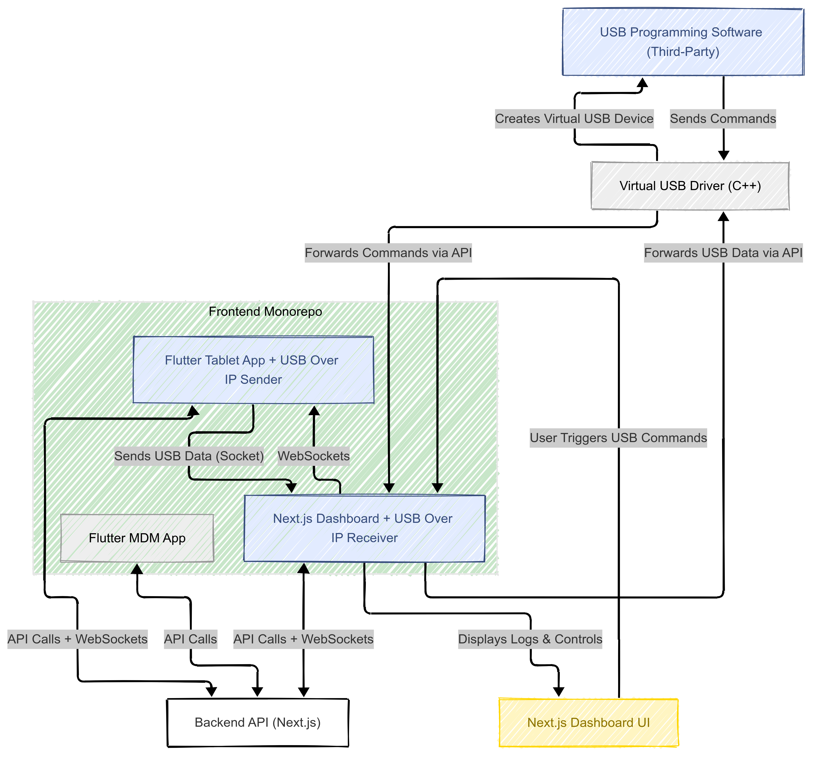

# Earkart Frontend Monorepo 🚀

Welcome to the Earkart Frontend Monorepo! This repository houses our suite of modern frontend applications, providing a unified development experience across multiple platforms.



## 📱 Applications

### Next.js Dashboard

A powerful and intuitive admin dashboard built with Next.js, providing comprehensive management and analytics capabilities.

### Flutter Applications

#### 1. Earkart Omni

Our flagship Flutter application designed for omnichannel operations, offering seamless integration across various sales channels.

#### 2. Earkart MDM

Master Data Management application built with Flutter, enabling efficient management of product data and business information.

## 🛠️ Tech Stack

- **Next.js**: For our web dashboard application
- **Flutter**: For cross-platform mobile applications
- **TypeScript**: For type-safe development in web applications
- **Dart**: For Flutter application development

## 📦 Project Structure

```
earkart-frontend/
├── apps/
│   ├── dashboard/        # Next.js admin dashboard
│   ├── earkart_omni/    # Flutter omnichannel app
│   └── earkart_mdm/     # Flutter MDM app
├── packages/            # Shared packages and components
└── assets/             # Shared assets and resources
```

## 🚀 Getting Started

### Prerequisites

- Node.js (v18 or later)
- Flutter (latest stable version)
- pnpm
- Git

### Installation

1. Clone the repository:

```bash
git clone [repository-url]
```

2. Install dependencies:

```bash
pnpm install
```

3. Set up Flutter projects:

```bash
cd apps/earkart_omni
flutter pub get

cd ../earkart_mdm
flutter pub get
```

## 💻 Development

### Running the Dashboard

```bash
pnpm dev:dashboard
```

### Running Flutter Apps

```bash
# For Omni app
cd apps/earkart_omni
flutter run

# For MDM app
cd apps/earkart_mdm
flutter run
```

## 🏗️ Building

To build all applications:

```bash
pnpm build
```

For individual Flutter apps:

```bash
# Omni app
cd apps/earkart_omni
flutter build apk  # For Android
flutter build ios  # For iOS

# MDM app
cd apps/earkart_mdm
flutter build apk  # For Android
flutter build ios  # For iOS
```

## 🔄 CI/CD

This repository uses Turborepo for efficient builds and caching. Our CI/CD pipeline ensures:

- Automated testing
- Code quality checks
- Build verification
- Deployment to respective environments

## 📚 Documentation

- [Dashboard Documentation](apps/dashboard/README.md)
- [Omni App Documentation](apps/earkart_omni/README.md)
- [MDM App Documentation](apps/earkart_mdm/README.md)

## 🤝 Contributing

1. Fork the repository
2. Create your feature branch (`git checkout -b feature/amazing-feature`)
3. Commit your changes (`git commit -m 'Add some amazing feature'`)
4. Push to the branch (`git push origin feature/amazing-feature`)
5. Open a Pull Request

## 📄 License

This project is licensed under the MIT License - see the [LICENSE](LICENSE) file for details.

---

Built with ❤️ by the Earkart Team.
